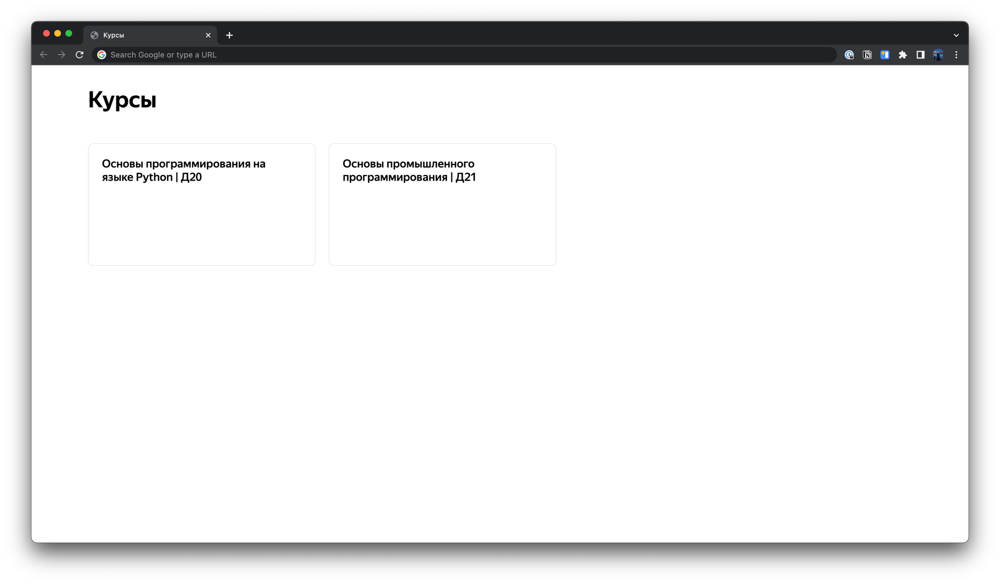
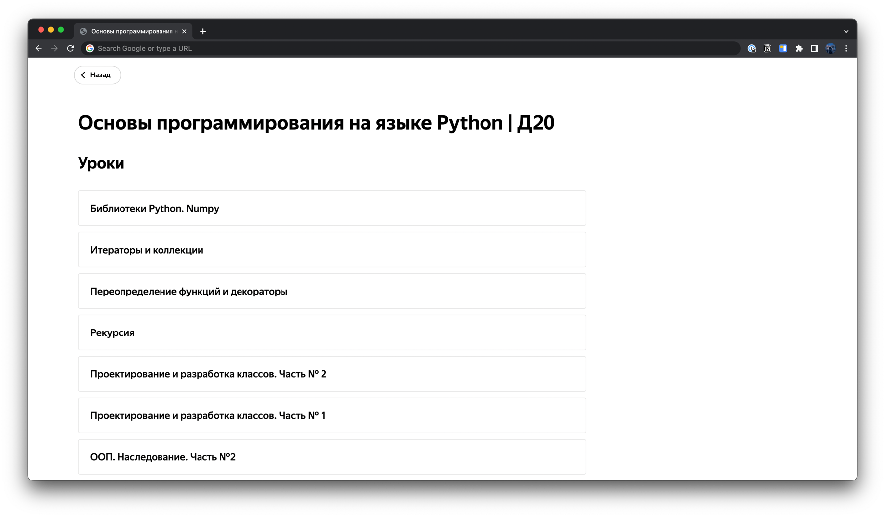
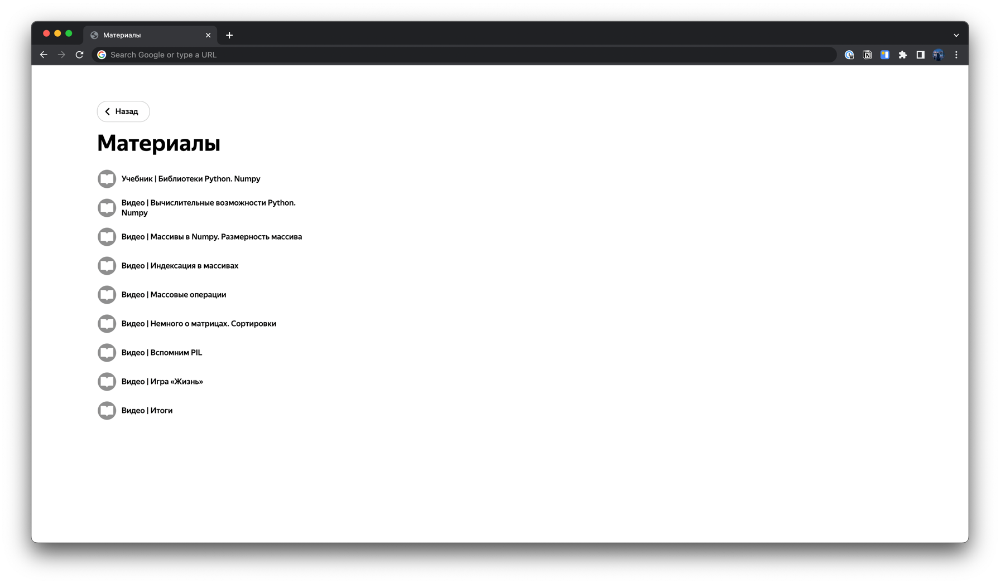
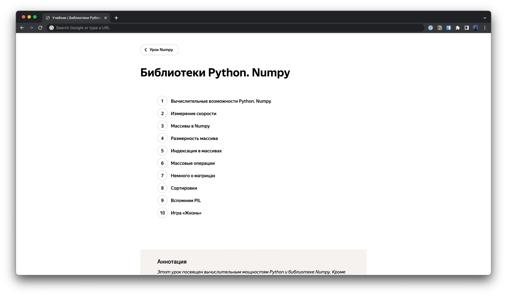

# Yandex Lyceum Docs
### Скрипт для удобного представления документации по любым курсам на платформе **Академии Яндекса**

  
Скриншоты

## Использование
* `git clone https://github.com/fast-geek/YandexLyceumDocs.git`
* `cd YandexLyceumDocs`
* `pip install -r requirements.txt`
* `python -m generator --login <YANDEX_USERNAME> --pasword <YANDEX_PASSWORD>`
* `cd docs`
* `python -m http.server 8000`
> Переходим на http://localhost:8000

## Примечание
Любые материалы, полученные с помощью Yandex Lyceum Docs разрешается использовать только в личных целях.
Распространение, публикация материалов запрещена в соответствии с пользовательским соглашением Академии Яндекса.
> Исключительное право на учебную программу и все сопутствующие ей учебные материалы, доступные в рамках проекта «Лицей Академии Яндекса», принадлежат АНО ДПО «ШАД». Воспроизведение, копирование, распространение и иное использование программы и материалов допустимо только с предварительного письменного согласия АНО ДПО «ШАД».
> [Пользовательское соглашение](https://yandex.ru/legal/lms_termsofuse/)
